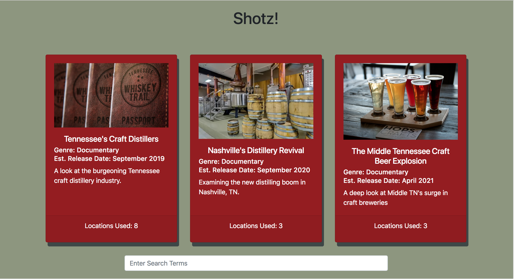
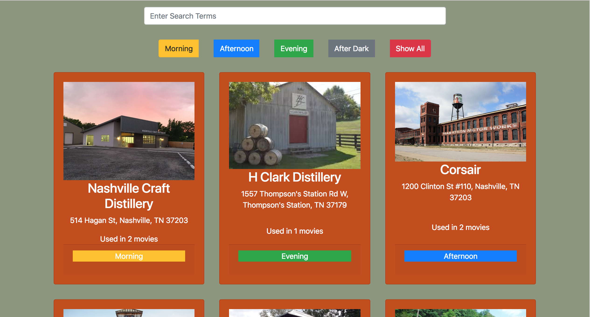

# Shotz

## Requirements

- As a user, I want to keep track of all the shooting locations for my soon to be oscar winning movie.
- Upon arriving at the homepage, I should see a section with information on my movie (keep it to just one movie).
- Upon arriving at the homepage, I should see a list of all locations that I plan to shoot, displayed as cards.
- As a user, I should be displayed a search bar. This search bar should filter the results of the cards. On keypress, the text I type in the search bar should be contained in either the location title text or the location address of all cards still displayed.
- As a user, I should be displayed 4 button options for "time of day." (Options: Morning, Afternoon, Evening, After Dark). These buttons should filter the results down to each location that has a "Shoot Time" corresponding to the button clicked.


## Tech Used

- Bootstrap.
- ES6 Modules.
- jQuery for
  - DOM manipulation
    - Event listeners
    - Selecting elements from the DOM
    - Traversal
    - Filtering results
  - AJAX call to the json file of locations





## How to run this project:

* Use nmp to install htpp-server:

```sh

npm install -g http-server

```
* Run the server:

```sh

hs -p 9999

```

* Open Chrome and navigate to:

```

localhost:9999

```